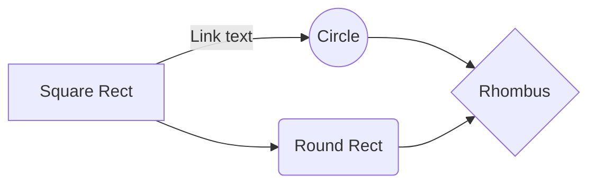

+++
title = 'Markdown渲染测试'
date = 2024-05-16 12:00:00
tag = '标签1'
+++

用文章直观测试markdown渲染样式。 <!--more-->

## 标题级别

### 三级标题

#### 四级标题

##### 五级标题

正文正文正文正文正文正文正文正文正文正文正文正文正文正文正文正文正文正文正文正文正文正文正文正文正文正文正文正文正文正文正文正文

## 列表

### 有序列表

1. 有序列表项1
2. 有序列表项2
   1. 有序列表项2.1
   2. 有序列表项2.2
3. 有序列表项3

### 无序列表

- 无序列表项1
- 无序列表项2
  - 无序列表项2.1
  - 无序列表项2.2
- 无序列表项3

### 任务列表

- [x] 任务列表1
- [ ] 任务列表2
  - [x] 任务列表2.1
  - [ ] 任务列表2.2
- [ ] 任务列表3

## 块

### 代码块

```python
from sqlalchemy import * 
class Movie(Base) : 
    __tablename__ = 'movies' 
    title = Column(String(255), nullable=False) 
```

### 公式块

$$
\begin{aligned}
&\min\limits_{\omega,\gamma}\frac{1}{2}\left\|w\right\|^2\\
&s.t.\ y_i(w^Tx_i)\ge1,\ i=1,2,\ldots,m
\end{aligned}
$$

### 表格

| 层           |   尺寸   |  参数量 |
| ------------ | :------: | ------: |
| Input        | 14,14,30 |       0 |
| Conv         | 14,14,64 |   54272 |
| Pool+Conv*2  | 7,7,128  | 221,449 |
| Pool+Flatten | 3,3,128  |       0 |

### 引用

> 引用文本引用文本引用文本引用文本引用文本引用文本引用文本引用文本引用文本引用文本引用文本引用文本。
>
> <p align="right">——鲁迅</p>

### Mermaid



### ASCII
```goat
      .               .--- 1  
      |           .---+        
  .---+---.       |   '--- 2   
  |       |    ---+           
.-+-.   .-+-.     |   .--- 3   
|   |   |   |     '---+        
1   2   3   4         '--- 4   
```

## 其他

### 脚注[^1]

[^1]: 脚注文本脚注文本脚注文本

### 脚注链接

[360][2]

[2]: http://www.fuckqq.com	"360安全"

### 水平分割线

------

### 目录

[TOC]

## 格式

正文*斜体*正文**加粗**正文***加粗斜体***正文

正文<u>下划线</u>正文~~删除线~~正文

内联公式$\max\limits_{\alpha}$

[超链接](https://unsplash.com/ "测试title文字")

带透明通道的图片

